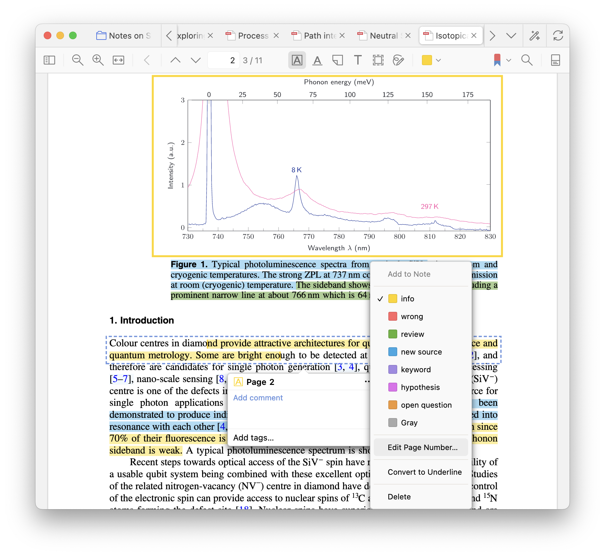
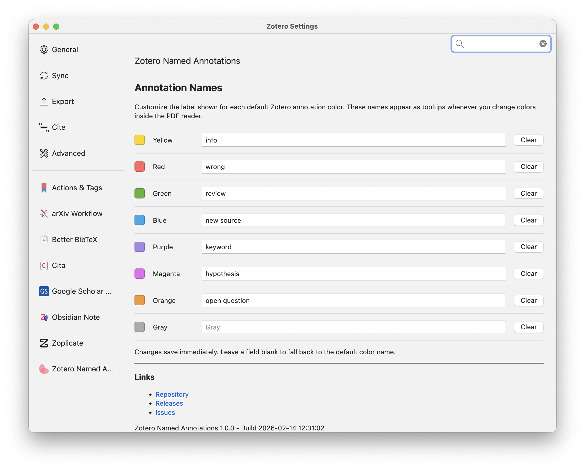

<div align="center">
  
  <h1>Zotero Named Annotations</h1>
  <p>Add human-friendly names to Zotero's default PDF annotation colors and see them as tooltips while you work.</p>
  <p>
    <a href="https://github.com/OliverDudgeon/zotero-named-annotations/releases/latest">Download</a>
    ·
    <a href="https://github.com/OliverDudgeon/zotero-named-annotations/issues">Report an issue</a>
  </p>
</div>

With this plugin, colours can be given names. This way your highlight system can be surfaced, so you remember your system.



Configure the names in the preferences window




## Usage

1. Install the latest `.xpi` from the [releases page](https://github.com/OliverDudgeon/zotero-named-annotations/releases/latest).
2. Open `Zotero ▸ Settings ▸ Zotero Named Annotations` on Zotero 7 (or `Zotero ▸ Preferences ▸ Zotero Named Annotations` on Zotero 6).
3. Type a short description next to any color swatch (e.g., “Key claims”).
4. Switch to the PDF reader and open the annotation color picker—the tooltip now matches your label.

## Development

```bash
pnpm install
pnpm build-dev
# Load builds/zotero-named-annotations.xpi into Zotero
```

The project uses esbuild + TypeScript and the [zotero-plugin-toolkit](https://github.com/windingwind/zotero-plugin-toolkit). See `scripts/` for helper commands.

## License

Distributed under the [AGPL-3.0](LICENSE). If you deploy a network service using this add-on, you must provide corresponding source code to your users.
